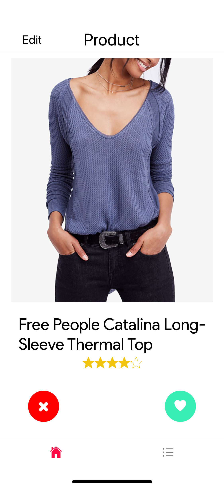
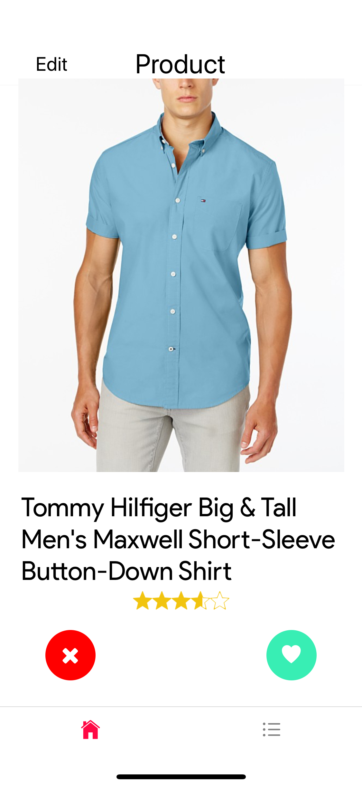
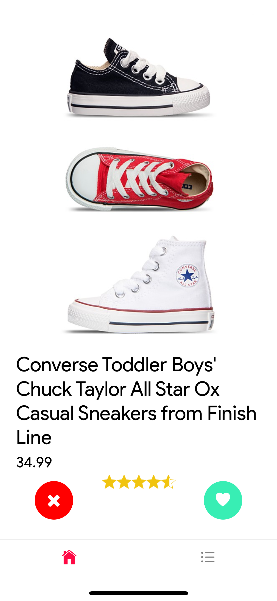
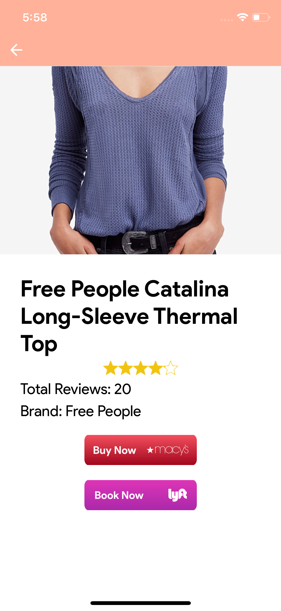

<p align="center">
<a href="https://github.com/mitulsavani/macysExpress.git">

</a>
<p align="center">
  Shopping is an experience; made it simple and easy to use!
</p>
</p>

## What can macysExpress do?

**A personalized product that helps you find and buy clothings based on your preferences**

This app was created at [SF Hacks 2019](https://sfhacks2020.com/). We wanted to make the shopping experience simple and familiar. Something that is similar to your favorite apps like Tinder and Pinterest. We tailored the app to Macy's and dynamically load items from their [API](http://developer.macys.com/page). The app can track user's shopping experience and offers you the items you liked most on next iteration.

- Users can **swipe** through crystal clear pictures
- **Save** liked items on their favorite list
- **Get referred** to Macy's online shop
- **Orders Lyft ride**, to the nearest Macy's store to buy the item you selected

## Preview


### [Demo - Try it on Expo](https://exp.host/@mitulsavani/macysExpress)

## Screens

|                                                         |                                                         |                                                         |
| :-----------------------------------------------------: | :-----------------------------------------------------: | :-----------------------------------------------------: |
|  |  |  |
|  |  |  |
|  |  |  |

## Dependencies

- react-native & Expo
- react navigation
- redux & react-redux
- redux-persist
- axios

## Getting started

```
git clone https://github.com/mitulsavani/react-native-macysExpress.git

yarn install

expo start

expo ios

expo android
```

## Feedback

In case you have any feedback or questions, feel free to open a new issues on this repo or reach out to any of us [**@bhaveshc20**](https://github.com/bhaveshc20) [**@anlai2**](https://github.com/anlai2) [**@mitulsavani**](https://github.com/mitulsavani) [**@jkhusanov**](https://github.com/jkhusanov) on Github.

Thanks
> updated on 04/13/2020 by Mitul Savani